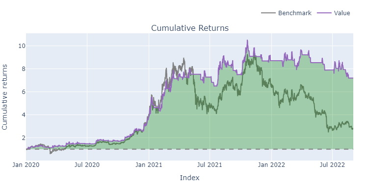
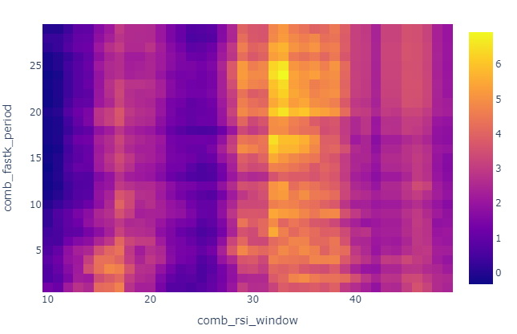

# BTC-USDT CTA Strategy Backtesting with Vectorbt

## Project Description
This project implements and backtests Commodity Trading Advisor (CTA) strategies on the BTC-USDT pair using the `vectorbt` library. The goal is to develop a robust framework for analyzing and optimizing trading strategies in the cryptocurrency market.

## Features
- Backtest various CTA strategies on BTC-USDT
- Utilize the powerful `vectorbt` library for efficient and flexible backtesting
- Generate performance reports and visualizations
- Support for strategy optimization and parameter tuning

  <figure style="margin: 0; width: 45%; text-align: center; display: flex; flex-direction: column; align-items: center;">
    
    <figcaption>Cumulative Return</figcaption>
  </figure>
  <figure style="margin: 0; width: 45%; text-align: center; display: flex; flex-direction: column; align-items: center;">
    
    <figcaption>Parameter Tuning</figcaption>
  </figure>

